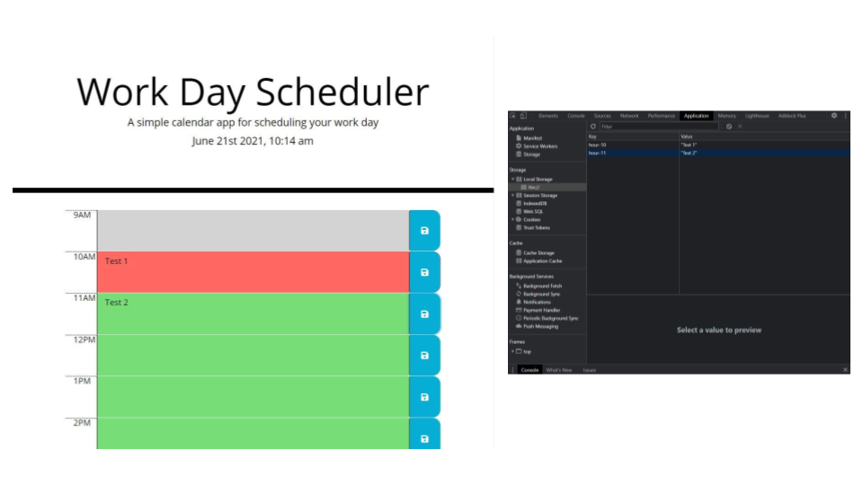

# 20210607 - Day-Scheduler-ZK 


 ## Table of Contents.
 * [Overview](#overview)
 * [Design](#overview)
 * [Criteria](#given-criteria)
 * [Questions](#have-questions)
 * [Links](#links)
 ---


## Overview 
Tasked to create a simple calendar application that allows a user to save events for each hour of the day by modifying given starter code. App runs in the browser and feature dynamically updated HTML and CSS powered by jQuery.

## Design


    UI uses assets from Bootstrap modified with given starter code.


---
## Given Criteria
* Incorporated [Moment.js](https://momentjs.com/) 
* Current day is displayed at the top of the calendar
* Uses timeblocks for standard business hours.
* Timeblock is color coded to indicate whether it is in the past, present, or future.
* User can input text into a timeblock and save text to local storage. 


---
## Have Questions
### You can contact me at:

    GITHUB: <https://github.com/ZacharyWK>

    EMAIL: <ZachKrause@live.com>


---
## Links
[REPOSITORY](https://github.com/ZacharyWK/Day-Scheduler-ZK)
```
https://github.com/ZacharyWK/Day-Scheduler-ZK
```

[DEPLOYED](https://zacharywk.github.io/Day-Scheduler-ZK/)
```
https://zacharywk.github.io/Day-Scheduler-ZK/
```
